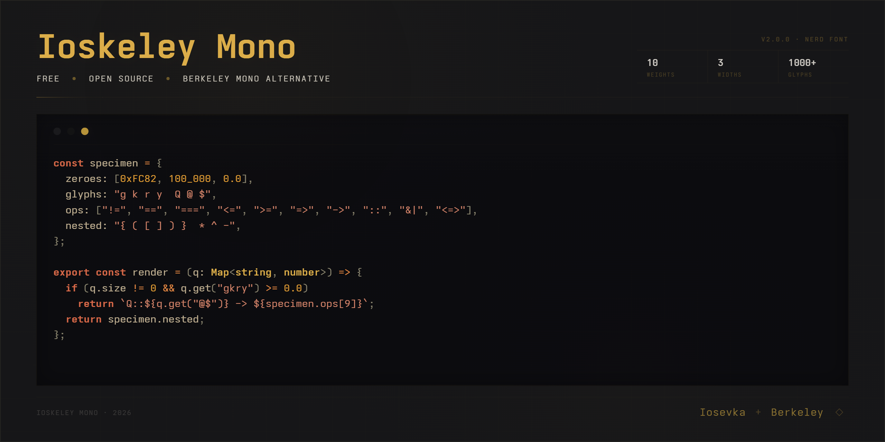
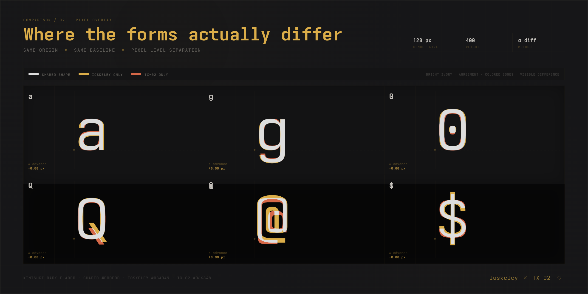

# Ioskeley Mono

<p align="center">
  
</p>

<p align="center">
  <a href="https://github.com/ahatem/IoskeleyMono/releases/latest"></a>
  <a href="https://github.com/ahatem/IoskeleyMono/releases"></a>
  <a href="./LICENSE"></a>
  <a href="https://ahatem.github.io/IoskeleyMono/"></a>
</p>

<p align="center">
  <strong>A free, open-source monospace font engineered to deliver the aesthetic, geometry, and metric parity of <a href="https://berkeleygraphics.com/typefaces/berkeley-mono/">Berkeley Mono</a>.</strong><br>
  Built by configuring <a href="https://github.com/be5invis/Iosevka">Iosevka</a> with custom glyph variants, metrics, and weight distributions.
</p>

<p align="center">
  <a href="https://ahatem.github.io/IoskeleyMono/"><strong>Explore Live Showcase →</strong></a> &nbsp;|&nbsp; 
  <a href="https://github.com/ahatem/IoskeleyMono/releases/latest"><strong>Download Latest Release →</strong></a>
</p>

---

## ⚡ Highlights

- **📐 Metric & Geometric Parity**: Custom line height, letter spacing, and character bounds tuned to Berkeley Mono's compact density.
- **🎨 10 Weights & 3 Widths**: Full weight spectrum (Thin `100` → Black `900`) across Normal, SemiCondensed, and Condensed, each with matching true italics (60 styles total).
- **🔤 Distinctive Glyph Engineering**: Dotted `0`, single-storey `g`, flat-arc parentheses `()`, open-contour `6` and `9`, two-circle `8`, raised underscore, and square punctuation.
- **💻 Tailored Variants**: Out-of-the-box support for Nerd Font icons, strict terminal grid alignment (`Term`), and ligature-free environments (`NL`).
- **🌐 Web Ready**: Pre-packaged WOFF2 web fonts with optimized `@font-face` definitions.

---

## 🔍 Comparison with Berkeley Mono

Ioskeley Mono is calibrated across character shapes, pixel overlays, and real-world code density.

### 01. Character Forms
> Exact identity glyphs, ambiguity-free numeral forms, compact punctuation bounds, and programming operators.


### 02. Pixel Overlay
> 1:1 origin and baseline overlay showing shared shape agreement (ivory) and minimal edge variances (colored).



### 03. Real-World Code Specimen
> Identical rhythm, line spacing, tracking, and visual weight in typical editor themes.


---

## 📦 Downloads & Variants

Grab pre-built packages from the [Releases page](https://github.com/ahatem/IoskeleyMono/releases/latest).

| Package | Use Case | Ligatures | Nerd Icons |
|---|---|:---:|:---:|
| **`IoskeleyMono.zip`** *(Recommended)* | VS Code, JetBrains, Zed, Sublime Text, Cursor | ✅ | — |
| **`IoskeleyMono-NerdFont.zip`** | Neovim, Starship, modern terminals with icon support | ✅ | ✅ |
| **`IoskeleyMono-Term.zip`** | Strict terminal grids (Kitty, Ghostty, WezTerm) | Grid | — |
| **`IoskeleyMono-Term-NerdFont.zip`** | Strict terminal grids + Nerd Font icons | Grid | ✅ |
| **`IoskeleyMono-NL.zip`** | Environments with forced ligatures (e.g. Xcode) | ❌ | — |
| **`IoskeleyMono-NL-NerdFont.zip`** | No ligatures + Nerd Font icons | ❌ | ✅ |
| **`IoskeleyMono-Web.zip`** | Web applications and CSS `@font-face` (WOFF2) | ✅ | — |

<details>
<summary><strong>📁 Package Internal Structure (Widths & Hinting)</strong></summary>

Every TTF package contains all 3 widths, organized by screen rendering target:

```
Normal/
  Hinted/    ← ClearType / standard-DPI screens (Windows)
  Unhinted/  ← High-DPI / Retina screens (macOS, Linux HiDPI)
SemiCondensed/
  Hinted/
  Unhinted/
Condensed/
  Hinted/
  Unhinted/
```
> *Recommendation:* If using macOS or high-DPI displays, install `Unhinted/`. For Windows standard-DPI monitors, install `Hinted/`.
</details>

---

## 🚀 Quick Setup & Editor Configuration

### Installation
- **macOS**: Unzip → Select all `.ttf` files in your chosen folder → Double click & click **Install Font** (or drag into Font Book).
- **Windows**: Unzip → Select all `.ttf` files → Right click → **Install for all users**.
- **Linux**: Unzip → Copy `.ttf` files to `~/.local/share/fonts/` (or `~/.fonts/`) → Run `fc-cache -fv`.

### Editor Configuration

#### VS Code / Cursor
```json
{
  "editor.fontFamily": "'Ioskeley Mono', monospace",
  "editor.fontLigatures": true,
  "editor.fontWeight": "400",
  "editor.fontSize": 14.5,
  "editor.lineHeight": 1.55
}
```
*(If using the Nerd Font variant, set `"editor.fontFamily": "'IoskeleyMono Nerd Font', monospace"`)*

#### Zed
```json
{
  "buffer_font_family": "Ioskeley Mono",
  "buffer_font_size": 15,
  "buffer_line_height": "comfortable"
}
```

#### Ghostty
```ini
font-family = Ioskeley Mono
font-size = 14
```

#### Alacritty
```toml
[font.normal]
family = "Ioskeley Mono"
style = "Regular"
```

#### Kitty
```conf
font_family      Ioskeley Mono Term
bold_font        auto
italic_font      auto
bold_italic_font auto
font_size        14.0
```

---

## 📊 Weight Spectrum

Ioskeley Mono provides a full continuous weight spectrum across all 3 widths:

| Weight Name | CSS `font-weight` | Upright | Italic |
|---|---|:---:|:---:|
| **Thin** | `100` | Included | Included |
| **ExtraLight** | `200` | Included | Included |
| **Light** | `300` | Included | Included |
| **SemiLight** | `350` | Included | Included |
| **Regular** | `400` | Included | Included |
| **Medium** | `500` | Included | Included |
| **SemiBold** | `600` | Included | Included |
| **Bold** | `700` | Included | Included |
| **ExtraBold** | `800` | Included | Included |
| **Black** | `900` | Included | Included |

---

## 🛠️ Build from Source

Builds are executed via GitHub Actions on tagged releases. To reproduce locally:

```bash
# 1. Clone repositories
git clone https://github.com/ahatem/IoskeleyMono.git
git clone --depth 1 https://github.com/be5invis/Iosevka.git

# 2. Copy the customized build plan
cp IoskeleyMono/private-build-plans.toml Iosevka/

# 3. Install dependencies and compile
cd Iosevka
npm install
npm run build -- contents::IoskeleyMono contents::IoskeleyMonoTerm
```
Compiled TTF binaries will be output to `Iosevka/dist/IoskeleyMono/` and `Iosevka/dist/IoskeleyMonoTerm/`.

---

## 🤝 Contributing

Contributions, glyph refinement proposals, and build plan tweaks are welcome!
- For proposed character adjustments, check [`private-build-plans.toml`](./private-build-plans.toml).
- Submit bug reports, ligature suggestions, or PRs via GitHub Issues.

---

## ☕ Support

If Ioskeley Mono enhances your daily coding workflow or saves you font licensing fees, consider supporting ongoing development:

[](https://www.buymeacoffee.com/ahmedhatem)

---

## 📜 License & Acknowledgments

- **Ioskeley Mono** is released under the [SIL Open Font License 1.1](./LICENSE).
- Built on top of the [Iosevka](https://github.com/be5invis/Iosevka) font generation engine by [Belleve Invis](https://github.com/be5invis) and contributors.
- Design aesthetic inspired by [Berkeley Mono](https://berkeleygraphics.com/typefaces/berkeley-mono/) by Berkeley Graphics.
